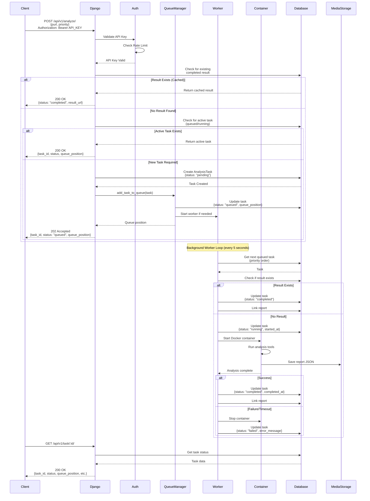
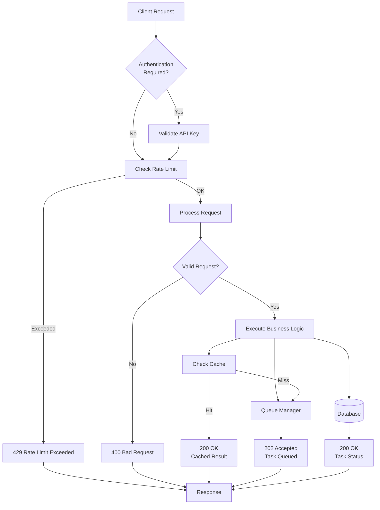

# Pack-a-mal System Architecture

## System Architecture Diagram

```mermaid
graph TB
    subgraph "Client Layer"
        CLIENT[API Clients<br/>curl, Python, etc.]
        WEB[Web Browser<br/>Dashboard UI]
    end

    subgraph "Web Server Layer"
        GUNICORN[Gunicorn<br/>WSGI Server]
        DJANGO[Django Application<br/>v5.1.6]
    end

    subgraph "API Layer - REST Endpoints"
        AUTH[Authentication Middleware<br/>API Key Validation<br/>Rate Limiting]
        
        API1[POST /api/v1/analyze/<br/>Submit Package Analysis]
        API2[GET /api/v1/task/:id/<br/>Get Task Status]
        API3[GET /api/v1/reports/<br/>List Tasks]
        API4[GET /api/v1/queue/status/<br/>Queue Status]
        API5[GET /api/v1/task/:id/queue/<br/>Queue Position]
        API6[GET /api/v1/timeout/status/<br/>Timeout Status]
        API7[POST /api/v1/timeout/check/<br/>Check Timeouts]
        
        DISCOVERY[Package Discovery APIs<br/>PyPI, npm, Packagist, etc.]
    end

    subgraph "Business Logic Layer"
        VIEWS[Django Views<br/>Request Handling]
        HELPER[Helper Functions<br/>PURL Parsing<br/>Report Generation]
        CACHE[Smart Caching<br/>Check Existing Results]
    end

    subgraph "Queue Management System"
        QUEUE_MGR[QueueManager<br/>Singleton Pattern]
        QUEUE_DB[(Task Queue<br/>Priority-based)]
        WORKER[Background Worker<br/>Thread-based<br/>Auto-start]
    end

    subgraph "Task Processing"
        TASK_STATES[Task States<br/>pending → queued → running → completed/failed]
        TIMEOUT[Timeout Monitor<br/>30 min default<br/>5 sec checks]
    end

    subgraph "Container Management"
        CONTAINER_MGR[ContainerManager<br/>Docker Operations]
        DOCKER[Docker Engine<br/>Single Container Execution]
        CONTAINER[Analysis Container<br/>Dynamic Analysis Tools]
    end

    subgraph "Analysis Tools"
        DYNAMIC[Dynamic Analysis]
        TYPOSQUAT[Typosquatting Detection]
        SOURCE[Source Code Finder]
        BANDIT[Bandit4Mal<br/>Static Analysis]
        MALCONTENT[Malcontent Analysis]
        LASTPYMILE[LastPyMile Analysis]
    end

    subgraph "Data Storage"
        POSTGRES[(PostgreSQL Database)]
        MODELS[Models<br/>- AnalysisTask<br/>- APIKey<br/>- Package<br/>- ReportDynamicAnalysis<br/>- ReportTyposquatting<br/>- ReportSource]
        MEDIA[Media Storage<br/>/media/reports/<br/>{ecosystem}/{package}/{version}.json]
    end

    subgraph "External Services"
        PYPI[PyPI Registry]
        NPM[npm Registry]
        PACKAGIST[Packagist]
        RUBYGEMS[RubyGems]
        MAVEN[Maven Central]
    end

    %% Client connections
    CLIENT -->|HTTPS/HTTP| GUNICORN
    WEB -->|HTTPS/HTTP| GUNICORN
    GUNICORN --> DJANGO

    %% API routing
    DJANGO --> AUTH
    AUTH -->|Valid API Key| API1
    AUTH -->|Valid API Key| API3
    AUTH -->|Public| API2
    AUTH -->|Public| API4
    AUTH -->|Public| API6
    AUTH -->|Public| API7
    AUTH -->|Public| DISCOVERY

    %% View processing
    API1 --> VIEWS
    API2 --> VIEWS
    API3 --> VIEWS
    API4 --> VIEWS
    API5 --> VIEWS
    API6 --> VIEWS
    API7 --> VIEWS
    DISCOVERY --> VIEWS

    VIEWS --> HELPER
    VIEWS --> CACHE
    CACHE --> POSTGRES

    %% Queue flow
    VIEWS -->|New Task| QUEUE_MGR
    QUEUE_MGR --> QUEUE_DB
    QUEUE_DB --> POSTGRES
    QUEUE_MGR --> WORKER
    WORKER -->|Process Next Task| TASK_STATES
    TASK_STATES --> TIMEOUT
    TIMEOUT --> CONTAINER_MGR

    %% Container execution
    WORKER -->|Start Container| CONTAINER_MGR
    CONTAINER_MGR --> DOCKER
    DOCKER --> CONTAINER
    CONTAINER --> DYNAMIC
    CONTAINER --> TYPOSQUAT
    CONTAINER --> SOURCE
    CONTAINER --> BANDIT
    CONTAINER --> MALCONTENT
    CONTAINER --> LASTPYMILE

    %% Data persistence
    VIEWS --> POSTGRES
    WORKER --> POSTGRES
    CONTAINER -->|Save Report| MEDIA
    WORKER -->|Update Task Status| POSTGRES
    HELPER -->|Save Report| MEDIA

    %% External registry access
    DISCOVERY --> PYPI
    DISCOVERY --> NPM
    DISCOVERY --> PACKAGIST
    DISCOVERY --> RUBYGEMS
    DISCOVERY --> MAVEN
    HELPER -->|Fetch Packages| PYPI
    HELPER -->|Fetch Packages| NPM

    %% Database models
    POSTGRES --> MODELS

    style CLIENT fill:#e1f5ff
    style WEB fill:#e1f5ff
    style GUNICORN fill:#fff4e1
    style DJANGO fill:#fff4e1
    style AUTH fill:#ffe1f5
    style QUEUE_MGR fill:#e1ffe1
    style WORKER fill:#e1ffe1
    style CONTAINER_MGR fill:#ffe1e1
    style DOCKER fill:#ffe1e1
    style POSTGRES fill:#f0e1ff
    style MEDIA fill:#f0e1ff
```

## Dynamic Analysis Architecture

This diagram focuses specifically on the dynamic analysis components and flow:

```mermaid
graph TB
    subgraph "API Entry Point"
        API[POST /api/v1/analyze/<br/>Submit Dynamic Analysis<br/>🔐 Auth Required]
        VIEWS[Django Views<br/>Request Handler]
    end

    subgraph "Request Processing"
        CACHE[Smart Caching<br/>Check Existing Results]
        HELPER[Helper Functions<br/>PURL Parsing<br/>Package Info]
    end

    subgraph "Queue Management"
        QUEUE_MGR[QueueManager<br/>Singleton Pattern]
        QUEUE_DB[(Task Queue<br/>Priority-based)]
        WORKER[Background Worker<br/>Thread-based<br/>Auto-start]
    end

    subgraph "Task Lifecycle"
        TASK_STATES[Task States<br/>pending → queued → running → completed/failed]
        TIMEOUT[Timeout Monitor<br/>30 min default<br/>5 sec checks]
    end

    subgraph "Container Management"
        CONTAINER_MGR[ContainerManager<br/>Docker Operations]
        DOCKER[Docker Engine<br/>Single Container Execution]
        SANDBOX[Analysis Sandbox<br/>docker.io/pakaremon/dynamic-analysis]
    end

    subgraph "Dynamic Analysis Execution"
        PHASES[Analysis Phases<br/>1. Import<br/>2. Install<br/>3. Execute]
        STRACE[strace Monitor<br/>System Call Tracing]
        PCAP[Packet Capture<br/>Network Monitoring]
        DNS_ANALYZER[DNS Analyzer<br/>DNS Query Tracking]
    end

    subgraph "Data Collection"
        SYS_CALLS[System Calls<br/>File Operations<br/>Commands Executed]
        NETWORK[Network Data<br/>DNS Queries<br/>IP Connections]
        FILES[File Operations<br/>Read/Write/Delete<br/>File Paths]
        EXEC_LOG[Execution Log<br/>Module Execution<br/>Symbol Tracking]
    end

    subgraph "Data Storage"
        POSTGRES[(PostgreSQL Database)]
        DYNAMIC_MODEL[ReportDynamicAnalysis Model<br/>- Package Info<br/>- Task Status<br/>- Report Link]
        MEDIA[Media Storage<br/>/media/reports/<br/>{ecosystem}/{package}/{version}.json]
    end

    subgraph "Report Structure"
        REPORT_JSON[JSON Report<br/>- Strace Summary<br/>- File Writes Summary<br/>- File Write Buffer IDs<br/>- Execution Log<br/>- Network Data]
    end

    %% API Flow
    API --> VIEWS
    VIEWS --> CACHE
    CACHE --> POSTGRES
    CACHE -->|Cache Hit| DYNAMIC_MODEL
    CACHE -->|Cache Miss| HELPER
    HELPER -->|New Task| QUEUE_MGR

    %% Queue Flow
    QUEUE_MGR --> QUEUE_DB
    QUEUE_DB --> POSTGRES
    QUEUE_MGR --> WORKER
    WORKER -->|Process Next Task| TASK_STATES
    TASK_STATES --> TIMEOUT
    TIMEOUT --> CONTAINER_MGR

    %% Container Execution
    WORKER -->|Start Container| CONTAINER_MGR
    CONTAINER_MGR --> DOCKER
    DOCKER --> SANDBOX
    SANDBOX --> PHASES

    %% Dynamic Analysis Components
    PHASES --> STRACE
    PHASES --> PCAP
    PCAP --> DNS_ANALYZER
    
    %% Data Collection
    STRACE --> SYS_CALLS
    STRACE --> FILES
    PCAP --> NETWORK
    DNS_ANALYZER --> NETWORK
    PHASES --> EXEC_LOG

    %% Data Persistence
    WORKER --> POSTGRES
    SYS_CALLS --> REPORT_JSON
    NETWORK --> REPORT_JSON
    FILES --> REPORT_JSON
    EXEC_LOG --> REPORT_JSON
    REPORT_JSON --> MEDIA
    WORKER -->|Save Report| MEDIA
    WORKER -->|Update Task| POSTGRES
    POSTGRES --> DYNAMIC_MODEL
    DYNAMIC_MODEL -->|Report Link| MEDIA

    %% Status Updates
    WORKER -->|Update Status| TASK_STATES
    TASK_STATES -->|Status: completed| POSTGRES
    TASK_STATES -->|Status: failed| POSTGRES

    style API fill:#ffe1e1
    style VIEWS fill:#fff4e1
    style QUEUE_MGR fill:#e1ffe1
    style WORKER fill:#e1ffe1
    style CONTAINER_MGR fill:#ffe1e1
    style DOCKER fill:#ffe1e1
    style SANDBOX fill:#ffe1e1
    style PHASES fill:#e1f5ff
    style STRACE fill:#e1f5ff
    style PCAP fill:#e1f5ff
    style POSTGRES fill:#f0e1ff
    style MEDIA fill:#f0e1ff
    style REPORT_JSON fill:#f0e1ff
```

### Dynamic Analysis Components

1. **Analysis Phases**
   - **Import Phase**: Monitors package import/require operations
   - **Install Phase**: Tracks package installation activities
   - **Execute Phase**: Observes package execution behavior

2. **Monitoring Tools**
   - **strace**: Captures all system calls (file operations, commands, network)
   - **Packet Capture (PCAP)**: Monitors network traffic at the packet level
   - **DNS Analyzer**: Tracks DNS queries and resolutions

3. **Data Collected**
   - **System Calls**: All syscalls made by the package
   - **File Operations**: Files read, written, or deleted
   - **Network Activity**: DNS queries, IP connections, protocols
   - **Commands**: Shell commands executed by the package
   - **Execution Log**: Module/symbol execution tracking

4. **Container Environment**
   - **Sandbox**: Isolated Docker container for safe execution
   - **Network Isolation**: Controlled network access for monitoring
   - **Timeout Protection**: 30-minute maximum execution time

## REST API Architecture Flow



## Component Details

### 1. Client Layer
- **API Clients**: External applications using REST API
- **Web Browser**: Dashboard UI for package discovery and analysis

### 2. Web Server Layer
- **Gunicorn**: WSGI HTTP server (production)
- **Django**: Web framework handling all requests

### 3. API Layer
- **Authentication**: API key validation via Bearer token or X-API-Key header
- **Rate Limiting**: Per-API-key rate limiting (default: 100 requests/hour)
- **REST Endpoints**: 7 main API endpoints for task management

### 4. Queue Management System
- **QueueManager**: Singleton pattern managing task queue
- **Background Worker**: Thread-based worker processing tasks sequentially
- **Priority System**: Tasks processed by priority (higher first), then queue position
- **Single Container Execution**: Only one analysis container runs at a time

### 5. Task Lifecycle
```
pending → queued → running → completed/failed
```

### 6. Container Management
- **ContainerManager**: Docker container lifecycle management
- **Timeout Monitoring**: 30-minute default timeout, checked every 5 seconds
- **Automatic Cleanup**: Timed-out containers are stopped automatically

### 7. Analysis Tools
- Dynamic Analysis
- Typosquatting Detection
- Source Code Finder
- Bandit4Mal (Static Analysis)
- Malcontent Analysis
- LastPyMile Analysis

### 8. Data Storage
- **PostgreSQL**: Primary database for all models
- **Media Storage**: JSON reports stored in `/media/reports/{ecosystem}/{package}/{version}.json`

### 9. Smart Caching
- Checks for existing completed results before queuing
- Returns cached results immediately if available
- No time-based expiration (results cached indefinitely)

## Key Features

1. **Idempotency**: Support for `X-Idempotency-Key` header to prevent duplicate requests
2. **Priority Queue**: Tasks can be assigned priority levels (0-9, higher = higher priority)
3. **Timeout Management**: Automatic timeout detection and container cleanup
4. **Rate Limiting**: Per-API-key rate limiting using Django cache
5. **Queue Status**: Real-time queue position and status tracking
6. **Package Discovery**: APIs for discovering packages from various registries (PyPI, npm, etc.)

## REST API Endpoints Overview

```mermaid
graph LR
    subgraph "REST API Endpoints"
        A1[POST /api/v1/analyze/<br/>Submit Package Analysis<br/>🔐 Auth Required]
        A2[GET /api/v1/task/:id/<br/>Get Task Status<br/>🌐 Public]
        A3[GET /api/v1/reports/<br/>List Tasks<br/>🔐 Auth Required]
        A4[GET /api/v1/queue/status/<br/>Queue Status<br/>🌐 Public]
        A5[GET /api/v1/task/:id/queue/<br/>Queue Position<br/>🔐 Auth Required]
        A6[GET /api/v1/timeout/status/<br/>Timeout Status<br/>🌐 Public]
        A7[POST /api/v1/timeout/check/<br/>Check Timeouts<br/>🌐 Public]
    end

    subgraph "Package Discovery APIs"
        D1[GET /get_pypi_packages/<br/>List PyPI Packages]
        D2[GET /get_pypi_versions/<br/>Get PyPI Versions]
        D3[GET /get_npm_packages/<br/>List npm Packages]
        D4[GET /get_npm_versions/<br/>Get npm Versions]
        D5[GET /get_packagist_packages/<br/>List Packagist Packages]
        D6[GET /get_packagist_versions/<br/>Get Packagist Versions]
        D7[GET /get_rubygems_packages/<br/>List RubyGems Packages]
        D8[GET /get_rubygems_versions/<br/>Get RubyGems Versions]
        D9[GET /get_maven_packages/<br/>List Maven Packages]
        D10[GET /get_rust_packages/<br/>List Rust Packages]
        D11[GET /get_wolfi_packages/<br/>List Wolfi Packages]
    end

    style A1 fill:#ffe1e1
    style A2 fill:#e1ffe1
    style A3 fill:#ffe1e1
    style A4 fill:#e1ffe1
    style A5 fill:#ffe1e1
    style A6 fill:#e1ffe1
    style A7 fill:#e1ffe1
    style D1 fill:#e1f5ff
    style D2 fill:#e1f5ff
    style D3 fill:#e1f5ff
    style D4 fill:#e1f5ff
    style D5 fill:#e1f5ff
    style D6 fill:#e1f5ff
    style D7 fill:#e1f5ff
    style D8 fill:#e1f5ff
    style D9 fill:#e1f5ff
    style D10 fill:#e1f5ff
    style D11 fill:#e1f5ff
```



### API Endpoint Details

| Endpoint | Method | Auth | Description |
|----------|--------|------|-------------|
| `/api/v1/analyze/` | POST | ✅ Required | Submit a package (PURL) for analysis |
| `/api/v1/task/:id/` | GET | ❌ Public | Get status of a specific task |
| `/api/v1/reports/` | GET | ✅ Required | List all tasks for your API key (paginated) |
| `/api/v1/queue/status/` | GET | ❌ Public | Get current queue status (all tasks) |
| `/api/v1/task/:id/queue/` | GET | ✅ Required | Get queue position of a specific task |
| `/api/v1/timeout/status/` | GET | ❌ Public | Get timeout status of running tasks |
| `/api/v1/timeout/check/` | POST | ❌ Public | Manually trigger timeout check |

### Request/Response Flow



## Technology Stack

- **Framework**: Django 5.1.6
- **Server**: Gunicorn 23.0.0
- **Database**: PostgreSQL
- **Container**: Docker
- **Language**: Python 3.x
- **Key Libraries**: 
  - GitPython (repository handling)
  - requests (HTTP client)
  - beautifulsoup4 (HTML parsing)
  - yara-python (pattern matching)

